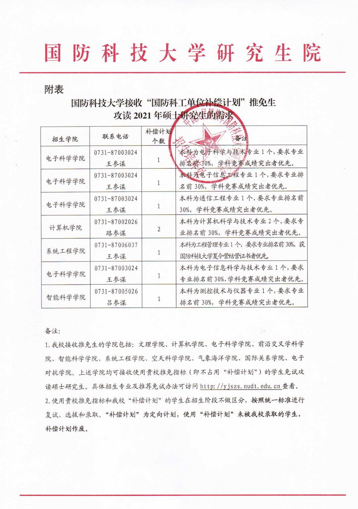
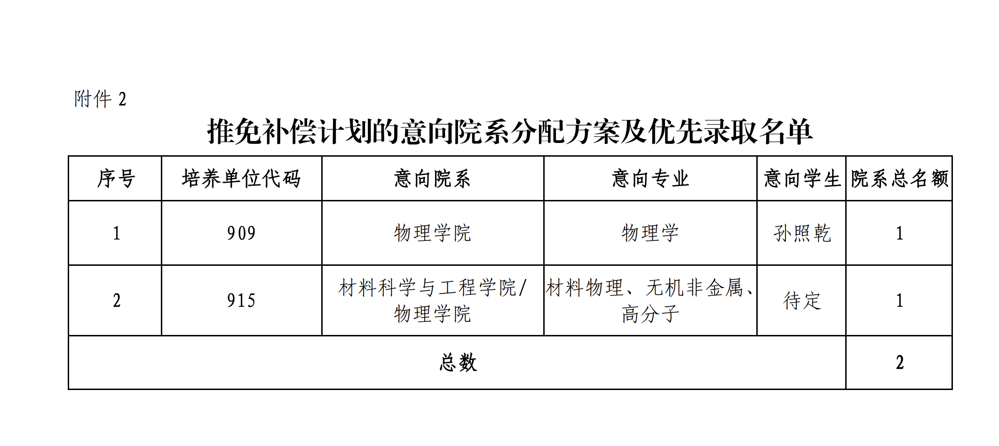
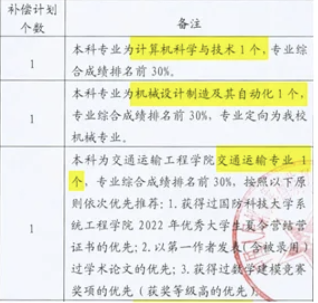
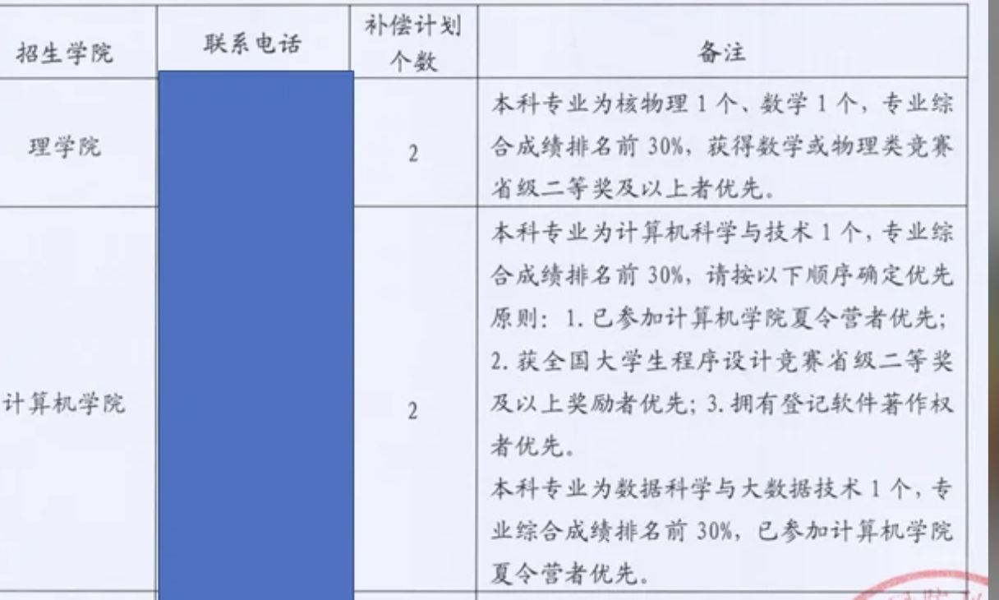
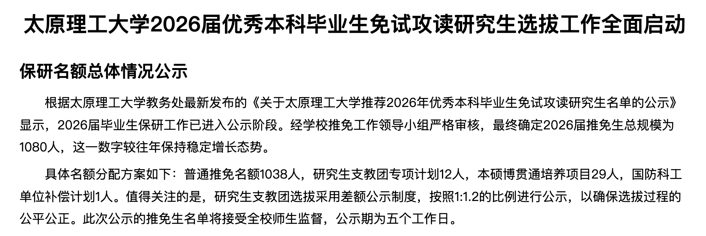

# 国防科工计划

::: warning 信息核实
国防科工计划涉及具体政策、资格要求和年份变化，具体名额、条件和流程请以招收院校、学校、学院当年公开通知为准。本文保留经验信息，也欢迎补充公开来源和亲历记录。
:::

## 什么是国防科工计划？

国防科工计划又称为补偿计划，通常**不占用本校普通推免名额**。需要注意的是，获得国防科工计划资格并不等于直接录取，仍需按招收院校要求参加后续选拔、复试或确认流程。

常见报名要求会关注成绩排名、专业背景和综合表现，例如部分通知会要求成绩排名在前 30% 以内。具体条件以当年招收院校和学校、学院通知为准。

## 招收院校

1. 国防科技大学
2. 中国工程物理研究院
3. 军事科学院

## 招收流程

1. 每年 6 月左右，招收院校发布国防科工计划招生简章，明确报名条件。报名方式与常规保研夏令营类似。
2. 7-8 月，参加目标院校夏令营，考核通过后，会有老师收集你更详细的个人信息，相关材料上报教育部。
3. 9 月推免名额从教育部下达到学校，再逐级下放到各学院和专业。此时教育部给到学校的推免名额中会携带一个类似**萝卜坑**的信息，可能是你获 xxx 比赛几等奖、xxx 专利/软著等，也可能直接包含你的姓名。该名额指定给某专业满足特定条件的同学，且**只允许**报考指定的院校。
4. 这时候你就可以联系学院说明该名额对应的是你，并证明自己满足相关条件，防止被他人截胡。

由于太原理工大学暂未公示相关投放函，下面展示一些其他高校收到的国防科工计划投放函样例。

吉林大学 2021 年国防科工计划投放函：

吉林大学 2024 年国防科工计划投放函：

某学校国防科工计划投放函：

某学校国防科工计划投放函：

## 我校历年投放情况

目前可从页面已有材料确认的信息：

- 2026 届：国防科工单位补偿计划 1 人

其他年份和具体招收单位信息仍需要补充公开来源或投放函后再写入。

## 欢迎补充

如果你有公开通知、亲历经验或可靠信息来源，可以补充年份、学院、流程和注意事项。请避免写入未经确认的政策细节。

## 参考信息

- [国防科技大学研究生招生信息网：2026 年申请渠道说明](https://yjszs.nudt.edu.cn/pubweb/homePageList/detailed.view?keyId=14191)
